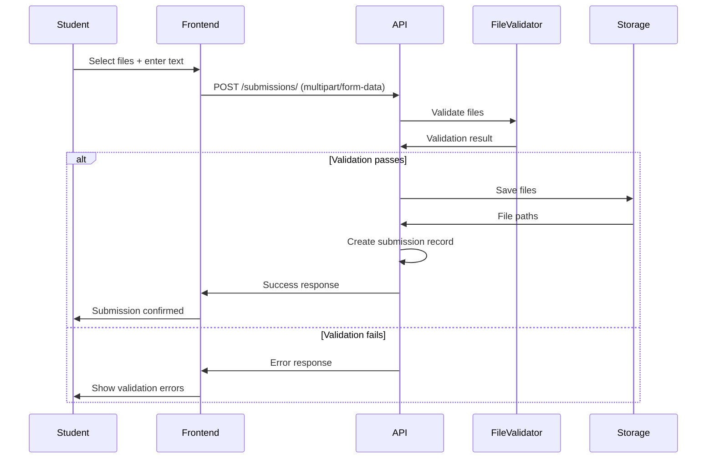
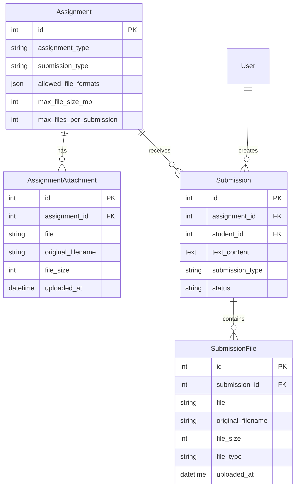

# Design Document

## Overview

The file-based assignments feature extends the existing AssignEase Django application to support non-coding assignments with file uploads and flexible submission types. This design builds upon the current models (Assignment, Submission, etc.) while adding new models and fields to handle file uploads, submission type configuration, and secure file management.

## Architecture

### High-Level Architecture

The solution follows Django's MVT (Model-View-Template) pattern and integrates with the existing REST API structure:

```
┌─────────────────┐    ┌─────────────────┐    ┌─────────────────┐
│   Frontend      │    │   Django REST   │    │   File Storage  │
│   (React/Vue)   │◄──►│   Framework     │◄──►│   (Media Files) │
└─────────────────┘    └─────────────────┘    └─────────────────┘
                              │
                              ▼
                       ┌─────────────────┐
                       │   Database      │
                       │   (PostgreSQL)  │
                       └─────────────────┘
```

### File Storage Strategy

- Use Django's FileField with custom upload paths
- Implement secure file naming with UUID prefixes
- Store files in organized directory structure: `uploads/assignments/{assignment_id}/{student_id}/`
- Use Django's built-in file validation and security features

## Components and Interfaces

### Model Extensions

#### 1. Assignment Model Enhancement
```python
class Assignment(models.Model):
    # Existing fields...
    
    # New fields for file-based assignments
    assignment_type = models.CharField(
        max_length=20, 
        choices=[('coding', 'Coding'), ('non_coding', 'Non-Coding')],
        default='coding'
    )
    submission_type = models.CharField(
        max_length=20,
        choices=[
            ('text_only', 'Text Only'),
            ('files_only', 'Files Only'), 
            ('text_and_files', 'Text and Files')
        ],
        default='text_only'
    )
    allowed_file_formats = models.JSONField(default=list, blank=True)
    max_file_size_mb = models.PositiveIntegerField(default=10)
    max_files_per_submission = models.PositiveIntegerField(default=5)
```

#### 2. New AssignmentAttachment Model
```python
class AssignmentAttachment(models.Model):
    assignment = models.ForeignKey(Assignment, on_delete=models.CASCADE, related_name='attachments')
    file = models.FileField(upload_to='assignment_attachments/')
    original_filename = models.CharField(max_length=255)
    file_size = models.PositiveIntegerField()
    uploaded_at = models.DateTimeField(auto_now_add=True)
```

#### 3. Enhanced Submission Model
```python
class Submission(models.Model):
    # Existing fields...
    
    # Enhanced for mixed submissions
    text_content = models.TextField(blank=True, null=True)  # Renamed from 'code'
    submission_type = models.CharField(
        max_length=20,
        choices=[('text', 'Text'), ('files', 'Files'), ('mixed', 'Mixed')]
    )
```

#### 4. New SubmissionFile Model
```python
class SubmissionFile(models.Model):
    submission = models.ForeignKey(Submission, on_delete=models.CASCADE, related_name='files')
    file = models.FileField(upload_to='submission_files/')
    original_filename = models.CharField(max_length=255)
    file_size = models.PositiveIntegerField()
    file_type = models.CharField(max_length=10)
    uploaded_at = models.DateTimeField(auto_now_add=True)
```

### API Endpoints

#### Assignment Management
- `POST /assignments/` - Create assignment with file configuration
- `GET /assignments/{id}/` - Get assignment details including file requirements
- `POST /assignments/{id}/attachments/` - Upload assignment attachments
- `GET /assignments/{id}/attachments/` - List assignment attachments

#### Submission Management  
- `POST /submissions/` - Create submission with files and/or text
- `GET /submissions/{id}/` - Get submission with files
- `GET /submissions/{id}/files/{file_id}/download/` - Download submission file
- `DELETE /submissions/{id}/files/{file_id}/` - Delete submission file (before final submission)

### File Upload Handling

#### Upload Process Flow


#### File Validation Rules
- File format validation against allowed types
- File size validation against limits
- Malware scanning (using python-magic for MIME type verification)
- Filename sanitization to prevent path traversal attacks

## Data Models

### Database Schema Changes

```sql
-- Add columns to existing Assignment table
ALTER TABLE assignment ADD COLUMN assignment_type VARCHAR(20) DEFAULT 'coding';
ALTER TABLE assignment ADD COLUMN submission_type VARCHAR(20) DEFAULT 'text_only';
ALTER TABLE assignment ADD COLUMN allowed_file_formats JSON;
ALTER TABLE assignment ADD COLUMN max_file_size_mb INTEGER DEFAULT 10;
ALTER TABLE assignment ADD COLUMN max_files_per_submission INTEGER DEFAULT 5;

-- Rename column in existing Submission table
ALTER TABLE submission RENAME COLUMN code TO text_content;
ALTER TABLE submission ADD COLUMN submission_type VARCHAR(20) DEFAULT 'text';

-- Create new tables
CREATE TABLE assignment_attachment (
    id SERIAL PRIMARY KEY,
    assignment_id INTEGER REFERENCES assignment(id) ON DELETE CASCADE,
    file VARCHAR(255) NOT NULL,
    original_filename VARCHAR(255) NOT NULL,
    file_size INTEGER NOT NULL,
    uploaded_at TIMESTAMP DEFAULT CURRENT_TIMESTAMP
);

CREATE TABLE submission_file (
    id SERIAL PRIMARY KEY,
    submission_id INTEGER REFERENCES submission(id) ON DELETE CASCADE,
    file VARCHAR(255) NOT NULL,
    original_filename VARCHAR(255) NOT NULL,
    file_size INTEGER NOT NULL,
    file_type VARCHAR(10) NOT NULL,
    uploaded_at TIMESTAMP DEFAULT CURRENT_TIMESTAMP
);
```

### Model Relationships



## Error Handling

### File Upload Errors
- **File too large**: Return 413 status with clear message about size limits
- **Invalid format**: Return 400 status with list of allowed formats
- **Too many files**: Return 400 status with file count limits
- **Storage full**: Return 507 status with retry instructions
- **Malware detected**: Return 400 status with security message

### Validation Errors
- **Missing required submission type**: Return 400 with submission requirements
- **Assignment deadline passed**: Return 400 with deadline information
- **Student not enrolled**: Return 403 with enrollment status

### Error Response Format
```json
{
    "error": "validation_failed",
    "message": "File validation failed",
    "details": {
        "file_errors": [
            {
                "filename": "document.exe",
                "error": "File format not allowed. Allowed formats: pdf, docx, jpg, png"
            }
        ]
    }
}
```

## Testing Strategy

### Unit Tests
- Model validation tests for new fields and constraints
- File upload validation tests with various file types and sizes
- Serializer tests for new fields and file handling
- View tests for file upload endpoints

### Integration Tests
- End-to-end submission workflow tests
- File download and access permission tests
- Assignment creation with file requirements tests
- Multi-file submission tests

### Security Tests
- File upload security tests (malicious files, path traversal)
- Permission tests for file access
- File size and format validation tests
- Cross-user file access prevention tests

### Performance Tests
- Large file upload performance tests
- Multiple concurrent upload tests
- File storage cleanup tests

## Security Considerations

### File Security
- Store uploaded files outside web root
- Use Django's secure file serving mechanisms
- Implement virus scanning for uploaded files
- Sanitize filenames to prevent path traversal

### Access Control
- Verify user permissions before file access
- Implement proper authentication for file downloads
- Log file access for audit trails
- Rate limiting for file uploads

### Data Protection
- Encrypt sensitive file metadata
- Implement secure file deletion
- Regular backup of uploaded files
- GDPR compliance for file storage and deletion